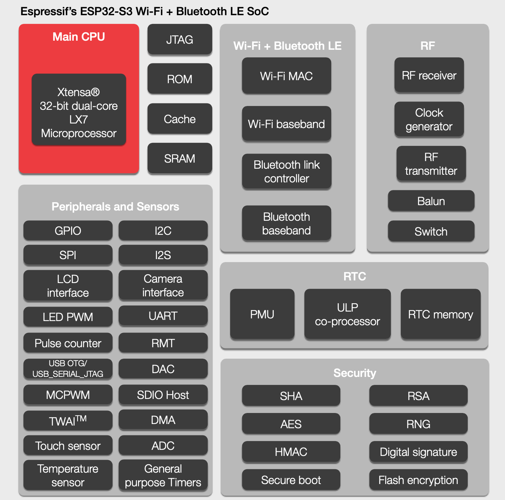

# [ESP32-S3](https://github.com/SoCXin/ESP32-S3)

* [Espressif](https://www.espressif.com/): [Xtensa LX7](https://github.com/SoCXin/MIPS)
* [L6R4](https://github.com/SoCXin/Level): 2 x 240 MHz x 2.5 DMIPS/MHz (660CoreMark)

### [简介](https://github.com/SoCXin/ESP32-S3/wiki)

[ESP32-S3](https://github.com/SoCXin/ESP32-S3)  是一款集成 2.4 GHz Wi-Fi 和 Bluetooth 5 (LE) 的 MCU 芯片，支持远距离模式 (Long Range)。ESP32-S3 搭载 Xtensa® 32 位 LX7 双核处理器，沿用乐鑫成熟的物联网开发框架 ESP-IDF。。

#### 关键参数

* Xtensa® LX7 240 MHz x 2
* 512 KB SRAM (TCM)
* Octal SPI flash
* Wi-Fi + Bluetooth 5 (LE)
* 44 x GPIO
* 超低功耗协处理器 (ULP)

### [资源收录](https://github.com/SoCXin)

* [参考资源](src/)
* [参考文档](docs/)
* [参考工程](project/)

### [选型建议](https://github.com/SoCXin/ESP32-S3)

[ESP32-S3](https://github.com/SoCXin/ESP32-S3) 聚焦 AIoT 市场，如语音交互、智能音频和基于机器学习的预见性维护设备等。

### [探索芯世界 www.SoC.xin](http://www.SoC.Xin)
