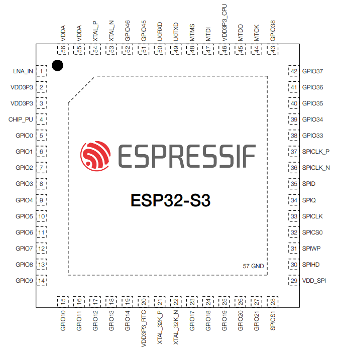

# [ESP32-S3](https://doc.soc.xin/ESP32-S3)

* [Espressif](https://www.espressif.com/): [Xtensa LX7](https://docs.soc.xin/espressif/index.html#esp-lx7)
* [L4R4](https://github.com/SoCXin/Level): 2 x 240 MHz (1181.6 CoreMark)

### [简介](https://github.com/SoCXin/ESP32S3/wiki)

[ESP32S3](https://github.com/SoCXin/ESP32S3) 是一款集成 2.4 GHz Wi-Fi 和 Bluetooth 5 (LE) 的 MCU 芯片，支持远距离模式 (Long Range)。ESP32-S3 搭载 Xtensa® 32 位 LX7 双核处理器，主频高达 240 MHz，内置 512 KB SRAM (TCM)，具有 45 个可编程 GPIO 管脚和丰富的通信接口。ESP32-S3 支持更大容量的高速 Octal SPI flash 和片外 RAM，支持用户配置数据缓存与指令缓存。

#### 关键参数

* Xtensa® LX7 240 MHz x 2
* 512 KB SRAM (TCM)，384 KB ROM
* Octal SPI flash
* Wi-Fi + Bluetooth 5 (LE)
* USB OTG FS
* 2 × SDIO 主机
* DMA 5 接收 + 5 发送
* 44 x GPIO，JTAG 接口
* 超低功耗协处理器RISC-V (ULP)
* 硬件加密加速器可支持 AES-128/256、Hash、RSA、HMAC，RNG
* QFN56 (7x7mm)

ESP32-S3 芯片有 45 个物理通用输入输出管脚 (GPIO Pin)。每个管脚都可用作一个通用输入输出，或连接一个内部外设信号。利用 GPIO 交换矩阵、IO MUX 和 RTC IO MUX，可配置外设模块的输入信号来源于任何的 GPIO管脚，并且外设模块的输出信号也可连接到任意 GPIO 管脚。

Open Source SDK [ESP-IDF](https://github.com/espressif/esp-idf)

### [资源收录](https://github.com/SoCXin)

* [参考资源](src/)
* [参考文档](docs/)
* [参考工程](project/)

### [选型建议](https://github.com/SoCXin/ESP32S3)

[ESP32-S3](https://github.com/SoCXin/ESP32S3) 类似的[Wi-Fi竞品](https://doc.soc.xin/application/wifi)包括

* Realtek Ameba [RTL8722DM](https://github.com/SoCXin/RTL8722DM)
* [W800](https://github.com/SoCXin/W800)
* [Air101](https://github.com/SoCXin/Air101)

### [www.SoC.xin](http://www.SoC.Xin)
